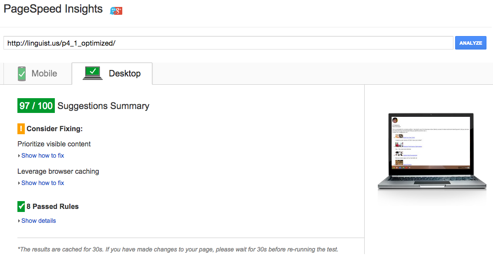
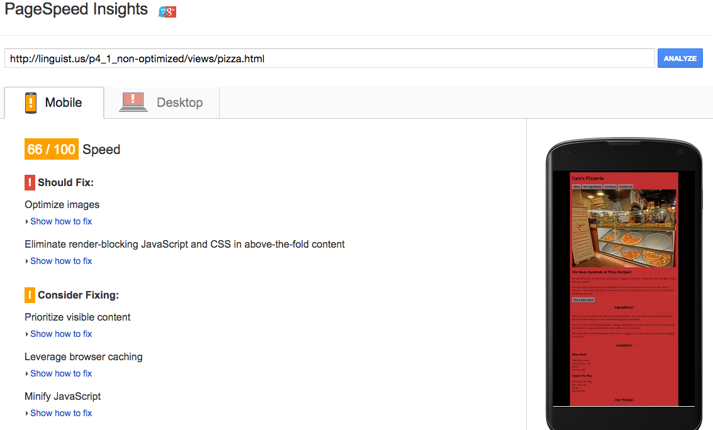
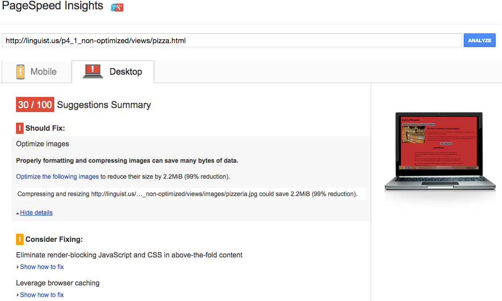
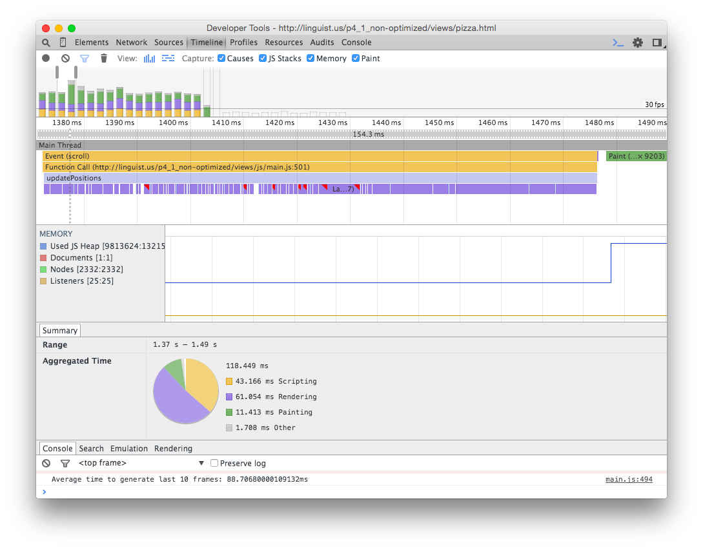
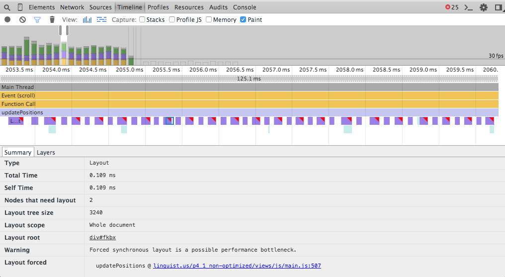
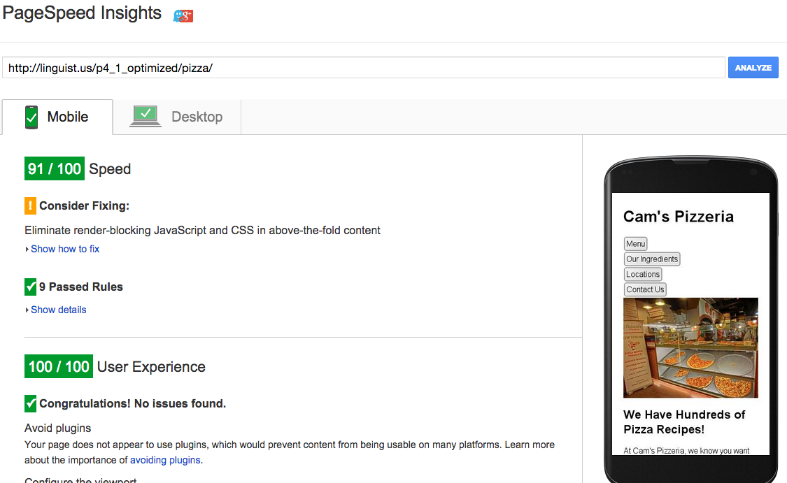
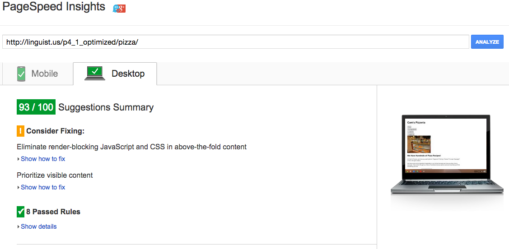
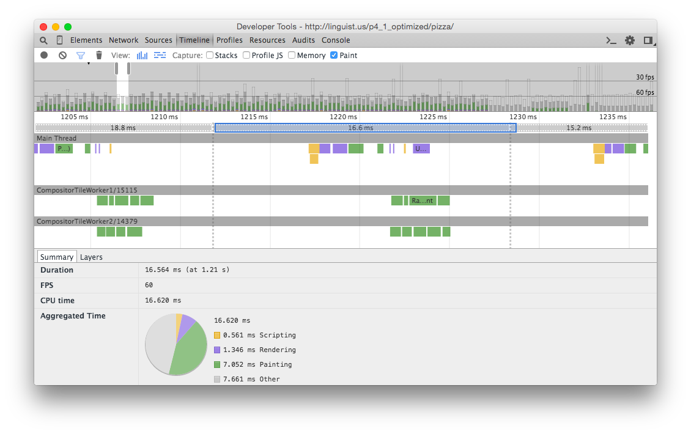
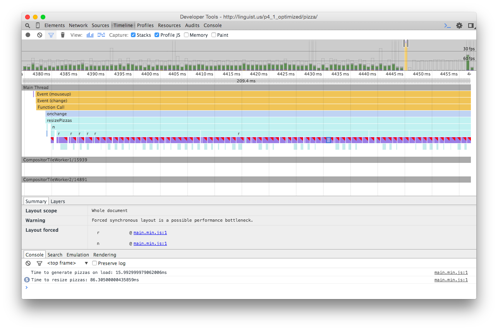
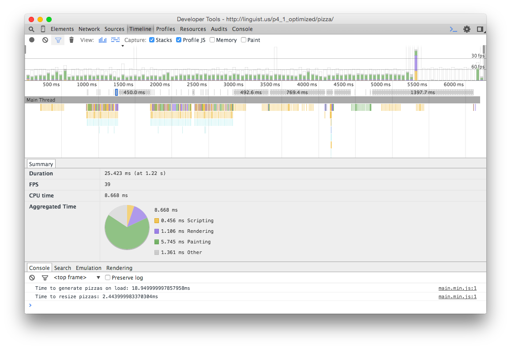

## Website Performance Optimization portfolio project

Optimize the critical rendering path and make this page render as quickly as possible by applying the techniques you've picked up in the [Critical Rendering Path course](https://www.udacity.com/course/ud884).

### Part 1 of web optimization

#### Getting started: Things done before optimization begins

1. Checked out the repository

1. Installed nodejs and npm

1. Installed bower (thru npm install -g within app folder) for web app dependencies;
  did bower init to create bower.json config and bower_components directory within app folder;
  used bower [...] --save to edit bower.json config

1. Installed knockout (thru bower) for JavaScript mvc framework. I did not have to use for this project but I wanted to practice use of bower for upcoming projects.

1. npm init within project folder
  used npm install [...] --save-dev to edit package.json config and install locally in project

1. installed GULP and gulp plugins npm install [...] --save-dev. This is to automate optimization process, e.g. image compression and minimification of CSS, JavaScript, and HTML files

#### Optimize PageSpeed Insights score for index.html

1. To inspect the site on your phone, you can run a local server
  ```bash
  $> cd /path/to/your-project-folder
  $> python -m SimpleHTTPServer 8080
  ```

1. Open a browser and visit localhost:8080

1. Download and install [ngrok](https://ngrok.com/) to make your local server accessible remotely.
  ``` bash
  $> cd /path/to/your-project-folder
  $> ngrok 8080
  ```

1. Copy the public URL ngrok gives you and try running it through PageSpeed Insights!

#### OPTIMIZATION STEPS

1. Using Gulp for this project. For practice, I converted CSS files to SASS scss format. This will allow me to easily preprocess in case I change anything.

1. changed below by adding attribute media="print":
``` html
<link href="styles/print.css" rel="stylesheet" media="print">
```

1. deleted old google analytics script from all HTML files and changed it to an asynchronous script from google. This is an asynchronous link to analytics.js according to Google analytics.
CODE:
``` html
<script>
  (function(i,s,o,g,r,a,m){i['GoogleAnalyticsObject']=r;i[r]=i[r]||function(){
  (i[r].q=i[r].q||[]).push(arguments)},i[r].l=1*new Date();a=s.createElement(o),
  m=s.getElementsByTagName(o)[0];a.async=1;a.src=g;m.parentNode.insertBefore(a,m)
  })(window,document,'script','//www.google-analytics.com/analytics.js','ga');
  ga('create', 'UA-63683307-1', 'auto');
  ga('send', 'pageview');
</script>
```
1. Set up my own analytics ID

1. Examined Google Web Starter Kit to find out structure for usage of Gulp

1. Copied gulpfile.js from Google's web starter kit. See doc at https://developers.google.com/web/tools/starter-kit/

1. Tested web page with 'gulp serve' to see temp page in action.

1. Uploaded to live server (http://linguist.us/p4_1_non-optimized/views/pizza.html) the NON-optimized version and analyzed with pageSpeed -- 28/100 for mobile and 30/100 for desktop


1. Built minized assets using Gulp

1. Built minimized JS scripts. I got the idea from Google Web starter kit with the block <!-- build:js scripts/perfmatters.min.js --> in the HTML page.

1. Deleted link to Google's CDN of web fonts to improve pageSpeed scores

1. Deferred loading of style.css by using code below from Google which it claims to be ASYNCHRONOUS
``` html
<script>
var cb = function() {
var l = document.createElement('link'); l.rel = 'stylesheet';
l.href = 'styles/style.css';
var h = document.getElementsByTagName('head')[0]; h.parentNode.insertBefore(l, h);
};
var raf = requestAnimationFrame || mozRequestAnimationFrame ||
webkitRequestAnimationFrame || msRequestAnimationFrame;
if (raf) raf(cb);
else window.addEventListener('load', cb);
</script>
```
1. Commented out link tag to styles/style.css

1. I also added a .htaccess file for caching purposes

1. After the final results of the PageSpeed analysis after optimization -- 99/100 for mobile and 97/100 for desktop. Live version here: http://linguist.us/p4_1_optimized




1. EXTRA documents here:

2. [NON-optimized PageSpeed Analysis for mobile](documents/portfolio/mobile-NONoptimized.pdf)
2. [NON-optimized PageSpeed Analysis for desktop](documents/portfolio/desktop-NONoptimized.pdf)

2. [Optimized PageSpeed Analysis](documents/portfolio/desktop-optimized.pdf)


### Part 2 of web optimization: Optimize Frames per Second in pizza.html

#### First steps: Measurements

1. measured with google PageSpeed Insights first to see what needs to be optimized on loading without user events. For mobile the score is 66/100 and for desktop 30/100 (http://linguist.us/p4_1_non-optimized/views/pizza.html).





1. As my screenshots show, the timeline of the NON-optimized pizza web page is below 30 FPS with scrolling and clicking events.






2. Most the errors or warnings are of "Forced Synchronous Layout". Download timeline here for further analysis of results above: (documents/pizza/TimelineRawData-pizzaNonOptimized.json.zip)


### OPTIMIZATION STEPS:

1. I optimized all the assets CSS, JS, HTML, and image files using Gulp. After optimization of some assets, mobile score is 91/1
00 and desktop 93/100 (http://linguist.us/p4_1_optimized/pizza/).





1. in addition to Optimization courses, I read udacity's notes at https://github.com/udacity/fend-office-hours/tree/master/Web%20Optimization/Effective%20Optimizations%20for%2060%20FPS and also watched udacity's webcast to help me with the solution: https://plus.google.com/events/c8eah6f0d0t9eretebpm7dqi0ok?authkey=CKaNhtb0quvqKA

To optimize pizza project, I modified main.js until frames per second rate is 60 fps or higher.

1. I took out scrollTop out of the FOR loop in the function updatePositions() in main.js and decreased the number of sliding pizzas from 200 to 20 in document.addEventListener('DOMContentLoaded', function() {}

1. The screenshot shows that the FPS increased from 30 FPS. The 60fps line is now showing in the timeline


1. In the chrome developer console, the average time to load last 10 frames went from 30-48ms to .30 ms.

1. For the slider event: after taking out any "reading" of layout properties out of FOR loops which "forced synchronous layout", the timeline results are here. The time to resize pizzas took around 100ms or above. Please note all the rectangles indicating multiple warnings to forced synchronous layout. [SLOW](http://linguist.us/p4_1_non-optimized/views/pizza.html)


1. After revising changePizzaSizes, I was able to get the to reload the pizzas
down to 2ms [FASTER](http://linguist.us/p4_1_optimized/pizza/).




-----------------------------
You might find the FPS Counter/HUD Display useful in Chrome developer tools described here: [Chrome Dev Tools tips-and-tricks](https://developer.chrome.com/devtools/docs/tips-and-tricks).

### Optimization Tips and Tricks
* [Optimizing Performance](https://developers.google.com/web/fundamentals/performance/ "web performance")
* [Analyzing the Critical Rendering Path](https://developers.google.com/web/fundamentals/performance/critical-rendering-path/analyzing-crp.html "analyzing crp")
* [Optimizing the Critical Rendering Path](https://developers.google.com/web/fundamentals/performance/critical-rendering-path/optimizing-critical-rendering-path.html "optimize the crp!")
* [Avoiding Rendering Blocking CSS](https://developers.google.com/web/fundamentals/performance/critical-rendering-path/render-blocking-css.html "render blocking css")
* [Optimizing JavaScript](https://developers.google.com/web/fundamentals/performance/critical-rendering-path/adding-interactivity-with-javascript.html "javascript")
* [Measuring with Navigation Timing](https://developers.google.com/web/fundamentals/performance/critical-rendering-path/measure-crp.html "nav timing api"). We didn't cover the Navigation Timing API in the first two lessons but it's an incredibly useful tool for automated page profiling. I highly recommend reading.
* <a href="https://developers.google.com/web/fundamentals/performance/optimizing-content-efficiency/eliminate-downloads.html">The fewer the downloads, the better</a>
* <a href="https://developers.google.com/web/fundamentals/performance/optimizing-content-efficiency/optimize-encoding-and-transfer.html">Reduce the size of text</a>
* <a href="https://developers.google.com/web/fundamentals/performance/optimizing-content-efficiency/image-optimization.html">Optimize images</a>
* <a href="https://developers.google.com/web/fundamentals/performance/optimizing-content-efficiency/http-caching.html">HTTP caching</a>

### Customization with Bootstrap
The portfolio was built on Twitter's <a href="http://getbootstrap.com/">Bootstrap</a> framework. All custom styles are in `dist/css/portfolio.css` in the portfolio repo.

* <a href="http://getbootstrap.com/css/">Bootstrap's CSS Classes</a>
* <a href="http://getbootstrap.com/components/">Bootstrap's Components</a>
